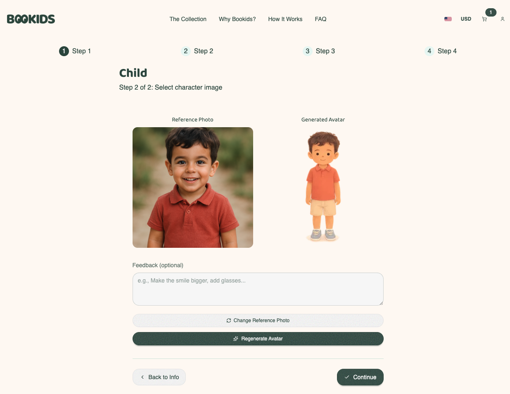
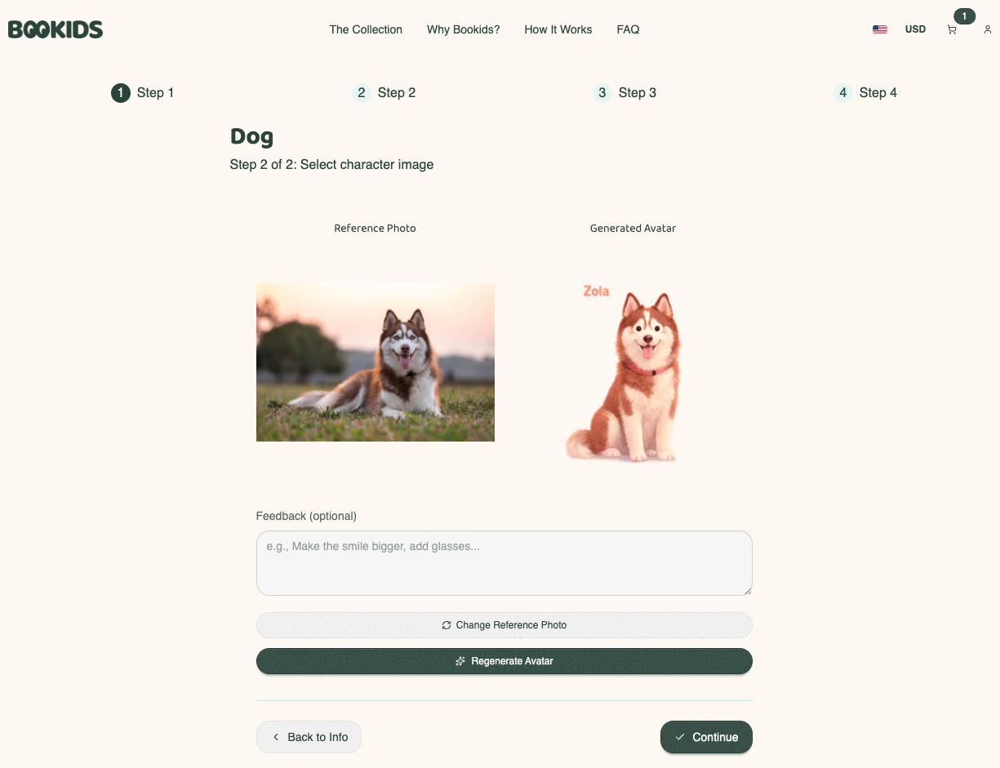
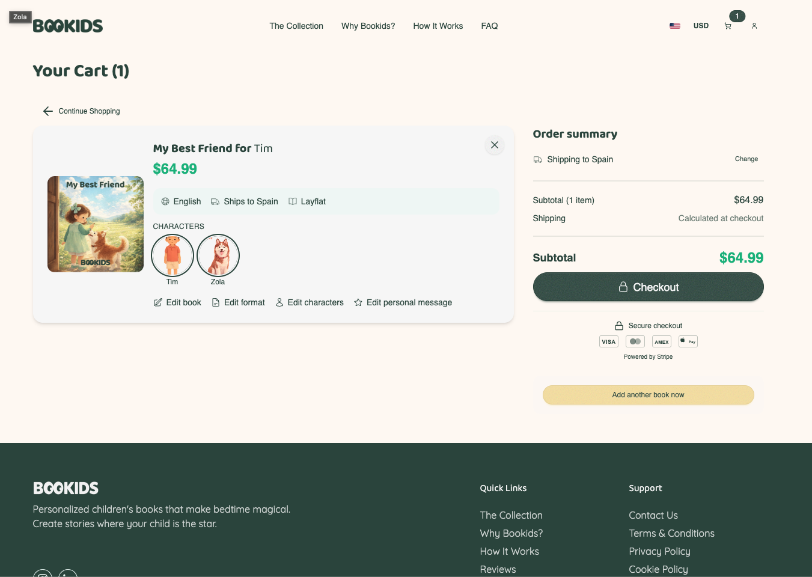
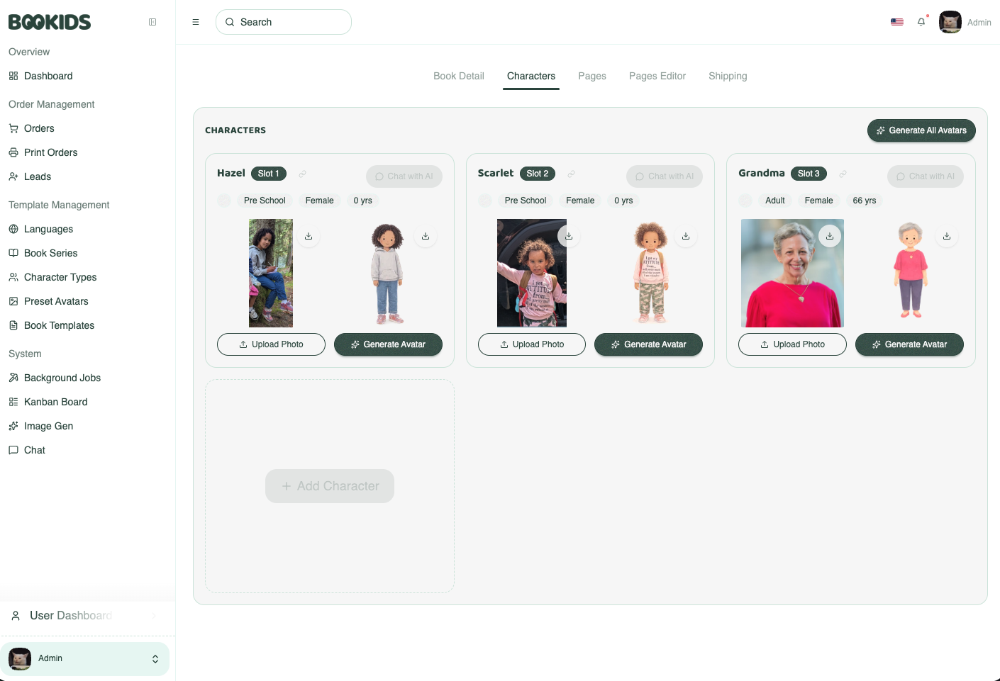
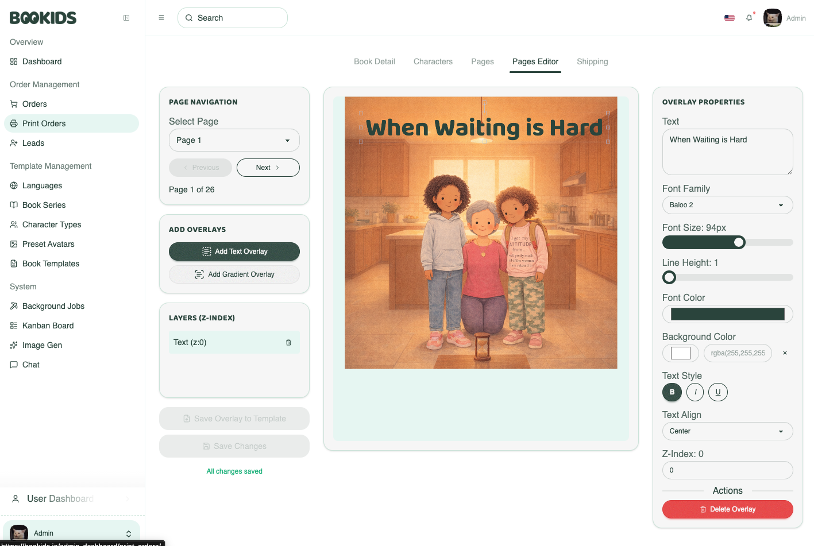
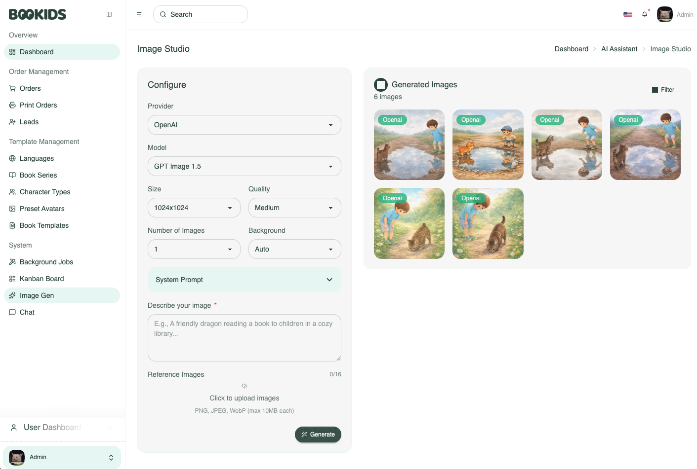

<p align="center">
  
</p>

# Bookids - AI-Powered Personalized Children's Books

**A full-stack Book Creation Platform where parents create one of a kind illustrated children's books personalized with their child's name, appearance, and story details — printed and delivered worldwide.**

> This is a portfolio showcase for a private production codebase.


<p align="center">
  
  
</p>

<p align="center">
  
  
</p>

<p align="center">
  
  
</p>

---

## What It Does

Parents upload a photo of their child, choose a story theme, and the platform generates a fully illustrated, print-ready children's book with AI-generated artwork that resembles their child. The finished book ships as a premium hardcover, softcover, or layflat format through print-on-demand fulfillment.

**Live product**: Personalized books in English and Spanish, shipped to 19+ countries across 3 shipping zones.

---

## Architecture Overview

```
┌─────────────────────────────────────────────────────────┐
│                      Browser                            │
│         Datastar (SSE) + DaisyUI + TailwindCSS          │
└──────────────────────┬──────────────────────────────────┘
                       │ SSE / HTTP
┌──────────────────────▼──────────────────────────────────┐
│                 Django 6.0 (Gunicorn)                   │
│  ┌─────────┐  ┌──────────┐  ┌─────────┐  ┌──────────┐   │
│  │ Views   │  │ Services │  │Selectors│  │  Models  │   │
│  │ (SSE)   │  │ (writes) │  │ (reads) │  │  (data)  │   │
│  └────┬────┘  └────┬─────┘  └─────────┘  └──────────┘   │
│       │            │                                    │
│  ┌────▼────────────▼─────────────────────────────────┐  │
│  │              Chancy Job Queue                     │  │
│  │  ┌──────────┐ ┌──────────┐ ┌───────────────────┐  │  │
│  │  │AI Tasks  │ │PDF Tasks │ │ Fulfillment/Email │  │  │
│  │  │(Process) │ │(Process) │ │    (Threaded)     │  │  │
│  │  └────┬─────┘ └────┬─────┘ └────────┬──────────┘  │  │
│  └───────│────────────│────────────────│─────────────┘  │
└──────────│────────────│────────────────│────────────────┘
           │            │                │
    ┌──────▼──┐  ┌──────▼────┐    ┌──────▼──────────┐
    │ OpenAI  │  │WeasyPrint │    │  Peecho API     │
    │ Images  │  │+ Pillow   │    │(Print-on-Demand)│
    └─────────┘  └───────────┘    └─────────────────┘

    ┌──────────┐  ┌──────────┐  ┌──────────┐
    │PostgreSQL│  │  AWS S3   │ │  Stripe  │
    │(DB+Queue)│  │(3 buckets)│ │(Payments)│
    └──────────┘  └──────────┘  └──────────┘
```

---

## Tech Stack

| Layer | Technology | Why This Choice |
|-------|-----------|-----------------|
| **Framework** | Django 6.0, Python 3.14 | Batteries-included, mature ORM, excellent i18n |
| **Frontend** | Datastar (SSE) + DaisyUI v5 + TailwindCSS v4 | Real-time reactivity without a JS framework or build step |
| **Components** | Django-Cotton | Server-rendered reusable components (like React, but no JS) |
| **Background Jobs** | Chancy (PostgreSQL-backed) | Lighter than Celery, no Redis dependency, workflow orchestration |
| **AI** | OpenAI Images API | Direct image model calls for avatar and illustration generation with feedback loops |
| **PDF Generation** | WeasyPrint + Pillow + PyMuPDF | HTML/CSS-to-PDF with image compositing and overlay system |
| **Payments** | Stripe (via dj-stripe) | Checkout sessions, subscriptions, multi-currency (EUR/USD/GBP) |
| **Print Fulfillment** | Peecho API | On-demand printing with catalog sync and country-specific availability |
| **Database** | PostgreSQL | Powers both Django ORM and Chancy job queue |
| **Storage** | AWS S3 (3-bucket architecture) | Private PDFs (signed URLs), public images, static assets |
| **Deployment** | Render (Web + Worker) | Managed PostgreSQL, zero-downtime deploys |
| **Static Files** | WhiteNoise + Brotli | Edge-optimized compression, no separate CDN needed |
| **Auth** | django-allauth + Google OAuth | Email + social login with custom user model |
| **i18n** | django-modeltranslation | Bilingual content (EN/ES) with per-field translations |
| **Security** | CSP, HSTS, django-axes, rate limiting | Production-hardened from day one |

---

## Key Decisions

### 1. No JavaScript Framework

The entire frontend uses **Datastar** — a 14KB library that adds reactivity through HTML attributes and Server-Sent Events.

**What this means in practice:**
- DOM updates happen server-side (Django renders HTML, sends via SSE)
- Reactive state lives in `data-signals` attributes, referenced with `$signal` syntax
- Loading spinners, form validation, polling via partial rendering of template fragments
- Two-way data binding via `data-bind`, visibility via `data-show`

**Why:** For a content-heavy e-commerce app, shipping a full SPA framework adds complexity without proportional value. Datastar gives real-time UX (loading states, live form updates, background job polling) with the simplicity of server-rendered HTML.

### 2. Config-Driven Story Variant System

Instead of hardcoding story logic, the template selection engine uses a **3-file config pattern** per book series:

```
data/template_selection_config/
├── your-child-special-day/
│   ├── _series.json          # Questions, variant mapping, localized labels
│   ├── variants/
│   │   ├── solo.json         # Character slots: 1 child
│   │   ├── duo.json          # Character slots: 2 children
│   │   ├── child-and-pet.json
│   │   └── family.json       # Character slots: 2 adults + 2 children
│   └── content/
│       ├── en/solo.json      # Page content + AI prompts (English)
│       └── es/solo.json      # Page content + AI prompts (Spanish)
```

**How it works:** Guided questions in Step 0 ("Who is the book for?", "Include a pet?") determine the character composition. The variant resolver maps that composition to the right template — which defines character slots, page layouts, and illustration prompts. Adding a new story variant means adding JSON files, not writing code.

**Why this matters:** The platform supports 5 book series with ~38 template variants across 2 languages. A code-based approach would mean dozens of conditionals. The config pattern keeps the selection engine under 100 lines while the content scales independently.

### 3. AI Avatar Generation with Iterative Feedback

Avatar generation is a **feedback loop** between the user and the Image model:

```
1. User uploads child's photo
2. Service builds prompt from character metadata
   (name, age, gender, character type + reference photo)
3. OpenAI Images API generates illustration-style avatar
4. User reviews result
5. User provides feedback: "make the hair curlier"
6. Feedback appends to generation history
7. Prompt rebuilt incorporating all prior feedback
8. New avatar generated — repeat until satisfied
```

Each character maintains an `avatar_generation_history` (JSON field) so the generation service has full context across regeneration attempts. It doesn't just retry with the same prompt — it accumulates understanding of what the user wants.

**Why this matters:** Most AI integrations are fire-and-forget. This pattern treats AI output as a draft that improves through conversation, which is closer to how professional illustrators work with clients.

### 4. Workflow Orchestration for Book Generation

Generating a printed book requires **8+ async jobs with strict dependencies**:

```
generate_page_1_image ──┐
generate_page_2_image ──┤
generate_page_3_image ──┼──→ composite_overlays ──→ render_pdf ──→ generate_spine ──→ submit_to_printer
...                     │
generate_page_N_image ──┘
```

All page illustrations can run in parallel, but PDF rendering must wait for all pages. Spine generation needs the PDF. Print submission needs both.

This is managed through Chancy's **WorkflowPlugin** — jobs declare dependencies, and the orchestrator ensures correct execution order. Failed pages are tracked and skippable (the orchestrator continues with available pages rather than aborting the entire book).

**Reliability features built into the pipeline:**
- Unique job keys prevent duplicate page generation (`"page_image:{page_id}"`)
- Cooperative cancellation — each job checks a DB flag before making expensive API calls
- `FatalExceptionPlugin` catches permanent failures (missing data, auth errors) before retry logic kicks in
- Transient failures (API timeouts) retry with exponential backoff

### 5. PostgreSQL as the Only Infrastructure Dependency

Chancy uses PostgreSQL as its job queue backend (no Redis). The database cache backend handles rate limiting. This means the entire platform runs on **two processes** (web + worker) and **one database**.

---

## Feature Deep-Dives

### Multi-Step Book Personalization Flow

A 5-step wizard guides parents through creating their book:

| Step | What Happens | Technical Detail |
|------|-------------|-----------------|
| **Template Selection** | Guided questions determine the right story variant | JSON config files define questions, variants, and slot mappings per series |
| **Character Creation** | Upload photo, generate AI avatar, assign to story slots | Base64 upload via Datastar, OpenAI Images API with feedback loop, SSE polling |
| **Book Customization** | Set title, dedication message, choose format | Two-way data binding, format availability from Peecho catalog sync |
| **Shipping** | Select country, see available formats + rates | 19 countries across 3 shipping zones, real-time rate calculation |
| **Checkout** | Review order, pay via Stripe | Multi-currency, promotion codes, Stripe Checkout Sessions |

### AI Avatar Generation Pipeline

```
User uploads photo
  → Base64 decoded, validated, stored as character_image
  → Job pushed to ai_tasks queue (ProcessExecutor)
  → Service builds prompt from character metadata
     (name, age, gender, type + reference photo)
  → OpenAI Images API generates avatar
  → Avatar saved to character_avatar
  → SSE patches update UI (loading → complete)
  → User can regenerate with text feedback
     (feedback appended to prompt for iteration)
```

### PDF Generation Pipeline

```
All page illustrations complete
  → Orchestrator job triggers PDF generation
  → For each page:
     Load base illustration (AI-generated)
     Composite text overlays (font, position, color, rotation)
     Composite gradient overlays (type, angle, colors)
     Render to single-page PDF via WeasyPrint
  → Merge all pages with PyMuPDF
  → Generate spine PDF (width from Peecho API)
  → Upload to S3 (private bucket, signed URLs)
  → Submit to Peecho for printing
```

### Background Job Architecture

```
7 queues, 2 executor types, purpose-matched:

ProcessExecutor (memory isolation):
  ai_tasks      (concurrency: 2) — Avatar/illustration generation
  pdf_tasks     (concurrency: 1) — WeasyPrint rendering

ThreadedExecutor (lightweight I/O):
  fulfillment   (concurrency: 3) — Peecho API calls
  email         (concurrency: 3) — Transactional email
  image_studio  (concurrency: 3) — User-facing image gen
  tracking      (concurrency: 4) — Meta CAPI events
  maintenance   (concurrency: 1) — Guest cleanup, sessions
```

**Reliability features:**
- Unique job keys prevent duplicate submissions (`"{job_type}:{entity_id}"`)
- Cooperative cancellation (jobs check DB state before expensive API calls)
- `FatalExceptionPlugin` catches permanent failures before retry logic
- Workflow orchestrator manages multi-job dependencies

---

## Data Model Highlights

```
User
 ├── Characters (1:N) — each with uploaded photo + AI avatar
 ├── Books (1:N)
 │    ├── BookTemplate (story structure)
 │    ├── BookCharacters (M2M with slot assignment)
 │    └── BookPages (1:N) — illustration + text/gradient overlays
 └── Orders (1:N)
      └── OrderBooks (1:N) — format, print status, fulfillment

BookTemplate
 ├── BookSeries (story collection)
 ├── CharacterSlots (defines who appears where)
 └── TemplatePages (content blueprint copied to BookPages)

ShippingRate
 └── Zone-based pricing (A/B/C + Rest-of-World)
```

**Design choices:**
- UUID7 primary keys (sortable, collision-resistant)
- JSON fields for overlay configurations (flexible without migrations)
- Template variant resolution based on character composition
- Nullable `Book.template` allows entry at Step 1 before template is determined

---

## Infrastructure

| Component | Service | Configuration |
|-----------|---------|--------------|
| Web server | Render Web Service | Gunicorn, 2GB RAM |
| Background worker | Render Worker | Chancy, 2GB RAM |
| Database | Render PostgreSQL | Connection pooling (600s), health checks |
| Object storage | AWS S3 (eu-west-1) | 3 buckets: private (signed URLs), public, static |
| Payments | Stripe | Live + test environments, webhook processing |
| Email | Resend (via django-anymail) | Transactional emails |
| Print | Peecho | Catalog sync, order submission, tracking |
| AI | OpenAI | GPT-image-1.5, Google Flash Image  |

**Security posture:**
- HSTS with preload (1 year)
- Content Security Policy enforcement
- django-axes brute force protection
- 12-character minimum passwords (NIST 800-63B)
- HttpOnly + Secure + SameSite cookies
- Signed S3 URLs for private content (7-day expiry)

---

## What I Built Solo

This is a **one-person full-stack build** covering:

- **19 Django apps** with clean separation of concerns
- **Service/selector architecture** for testable business logic
- **7 background job queues** with executor-appropriate isolation
- **Multi-step reactive forms** without JavaScript frameworks
- **AI integration** with iterative feedback loops for avatar generation
- **PDF generation** with memory optimization for constrained environments
- **Print-on-demand fulfillment** with catalog sync and zone-based shipping
- **Multi-currency payments** with subscription feature gating
- **Bilingual content** (English + Spanish) with per-field translations
- **Production security** hardened from the start
- **Component library** (~40 reusable server-rendered components)
